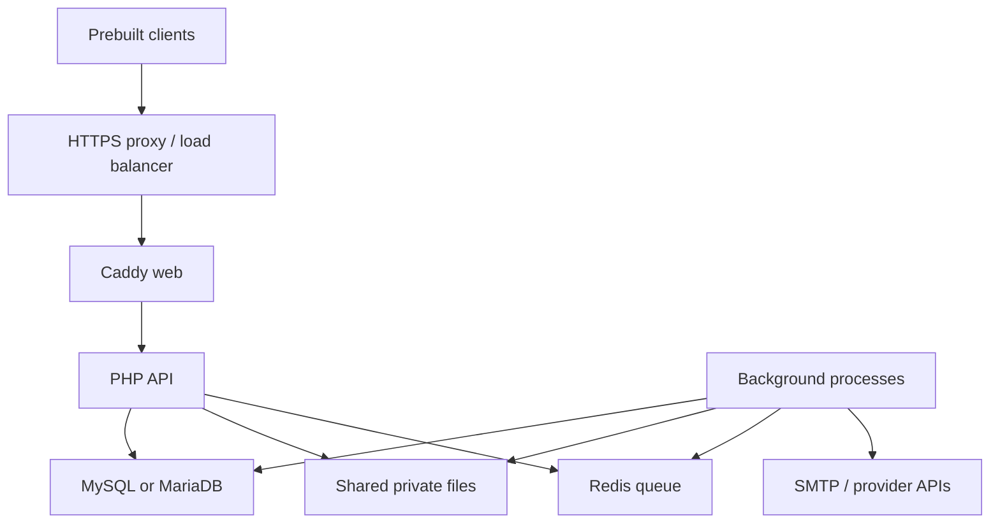

# Backend processes and scaling

Providentia is a **modular monolith deployed as several processes**. The modules
share a release, application code, relational schema and authorization rules.
Separate containers let the HTTP API, background jobs, database and broker use
different server resources. They are not independently versioned microservices.

`x-app-environment` and `x-cli` at the top of
[`compose.production.yaml`](../../compose.production.yaml) are YAML anchors:
reusable configuration for environment variables and container defaults. They
do not create containers. Entries under `services` do.



## What each service does

| Service | Responsibility | Baseline deployment |
|---|---|---|
| `web` | Caddy HTTP entry point; forwards requests to PHP-FPM; public files; separate authenticated metrics listener | One, behind your TLS reverse proxy |
| `api` | PHP-FPM executes HTTP requests, permissions and domain services | One initially; scale after shared-state and load tests |
| `worker` | Consumes Enqueue Redis messages | One initially |
| `outbox` | Relays committed database outbox events to the broker | One |
| `notification` | Delivers queued email, including login codes, through SMTP | One |
| `reference-update` | Watches and imports country/state/city reference updates | One |
| `data-governance` | Processes account exports and deletion jobs | One |
| `sync-compactor` | Applies synchronization retention/compaction | One |
| `ai-video-worker` | Processes uploaded videos using FFmpeg/FFprobe | One, with its own CPU/memory allocation |
| `volume-init` | Initializes only an empty application mount for UID/GID 82 | One-shot initial deployment action |
| `migrate` | Applies Doctrine schema migrations | One-shot deployment action; never one per API replica |
| `seed` | Imports the authorized checksum-verified starter catalog | Optional one-shot action with read-only `/seed` mount |
| `mysql` **or** `mariadb` | Relational source of truth | Choose one local profile or an external server |
| `redis` | Asynchronous broker with append-only persistence | Local profile or an external compatible broker |
| `backup` | Sends operator-prepared consistent snapshots to Restic | Optional one-shot action; does not create a DB dump |

The runtime and ordinary jobs use `ghcr.io/providentia-systems/backend`.
Only video processing needs the larger `backend-media-worker` image. Caddy uses
`backend-web`. Run all three images from the **same release manifest**.

## One database, one broker

The MySQL and MariaDB services exist to support two alternative engines and to
exercise compatibility in CI. The application uses one `DATABASE_URL`; it does
not combine the two databases or replicate between them. The production helper
selects exactly one of `mysql`, `mariadb`, or `external`. Changing that selection
after loading data is a database migration project, not a container toggle.

The queue adapter is Enqueue Redis. Redis and the tested Redis-compatible
Valkey backend are supported by the queue boundary; this configuration does
not implement RabbitMQ. A remote broker must be reachable privately from all
processes that use `QUEUE_DSN`.

## Moving parts to separate servers

| Placement | What must change |
|---|---|
| Database on a dedicated server | Use `--database external`, set `DATABASE_URL`, provision credentials/backups and private reachability; do not enable a local database profile |
| Broker on a dedicated server | Set an external `QUEUE_DSN`; omit the local Redis profile; configure authentication, private connectivity and persistence |
| Video worker on another server | Deploy the same media image digest and configuration; provide the same database and private-media files, matching encryption keys and file permissions |
| Web and API on separate servers | Set `PROVIDENTIA_FPM_UPSTREAM` to the private API address and port; provide private routing/firewall policy for PHP-FPM |
| Additional API replicas | Route Caddy/load balancer to healthy replicas of the same release; share DB, broker, secrets and persistent files; rehearse concurrent requests and deployment behavior |

Compose's `frontend` and `backend` networks are Docker bridge networks on one
host. Their names are not multi-server networking or firewall isolation by
themselves. Service names such as `api`, `mysql` and `redis` resolve within that
Compose network; use private DNS addresses or an orchestrator when crossing
hosts. PHP-FPM port 9000, SQL port 3306 and Redis port 6379 must stay private.
The bundled HTTP listener remains behind your TLS edge.

The first useful split is usually an application server, a database server and
a broker server. A separate video-processing server can follow when the
workload justifies it. Independent Docker volumes on those servers do **not**
share application data.

## Shared files and worker concurrency

Encrypted AI media and data-export artifacts currently use filesystem storage
under `/app/var` (`var/private-media` and `var/data-exports` by default). Every
process that writes or reads these artifacts must see the same durable files
at the same container paths. Across servers, provide a suitable shared
filesystem with consistent ownership (application UID/GID 82), or implement
and validate a shared object-storage adapter first. Matching folder names on
separate disks are insufficient. Catalog and profile images are database-backed;
they are not the reason for this filesystem requirement.

Start with **one instance of each background role**. Database transactions,
message receipts and job claims protect several operations against duplicate
processing, but that alone does not establish safe arbitrary replica counts:

- Outbox and notification delivery use time-limited leases. Notification batch
  leases are not renewed or fenced, so an overly slow batch may overlap a
  later claimant.
- Video and data-governance jobs claim work atomically, but a process killed
  after its claim can leave work needing recovery; automatic stale-claim
  recovery is not complete.
- Reference updates and synchronization compaction also need an explicit
  concurrency and recovery plan before increasing their process counts.

Before scaling a role, test duplicate delivery, concurrent claims, slow jobs,
process death, recovery and graceful shutdown against a representative
workload. Establish CPU/memory limits and queue-lag alerts from those results.
There is no measured capacity or high-availability guarantee implied by having
multiple Docker services.

## Keep the clients' URL stable

Use one operator-controlled HTTPS origin such as `https://api.example.net`.
Set backend `PUBLIC_BASE_URL` to that origin, with no `/api/v1` suffix,
path, query, credentials or fragment. Both the homeowner and admin apps
already read `PROVIDENTIA_API_BASE_URL` through Dart's compile-time
`String.fromEnvironment`; their production workflows receive it from the
GitHub Actions variable `PRODUCTION_API_BASE_URL` in each client repository.
The homeowner production build also sets `PROVIDENTIA_ENVIRONMENT=production`.

For example, a homeowner Android release build uses:

```bash
flutter build appbundle --release \
  --dart-define=PROVIDENTIA_ENVIRONMENT=production \
  --dart-define=PROVIDENTIA_API_BASE_URL=https://api.example.net
```

The application chooses its server when compiled; there is no end-user server
switch. Changing an environment variable on the backend host does not alter an
already-built app. Move servers, proxies or regional routing behind the same
DNS name and HTTPS certificate instead of shipping an infrastructure IP in the
app. A different app API origin requires rebuilding and distributing that app.
The origin is public configuration, not a client secret.

`CORS_ALLOWED_ORIGINS` describes browser application origins only. Native
Android/iOS/desktop apps do not need CORS entries. If a web client is hosted at
`https://app.example.net`, include that exact origin; do not use `*` for
credentialed browser sessions. Authentication uses codes entered in the
originating client, with no backend browser sign-in page.
