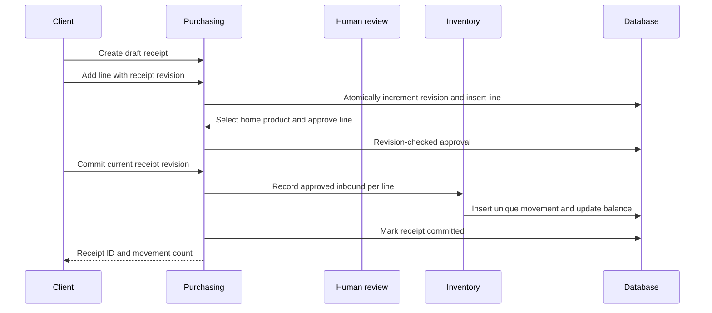
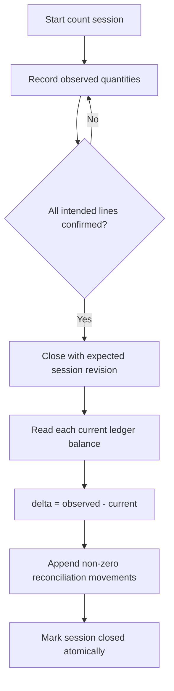
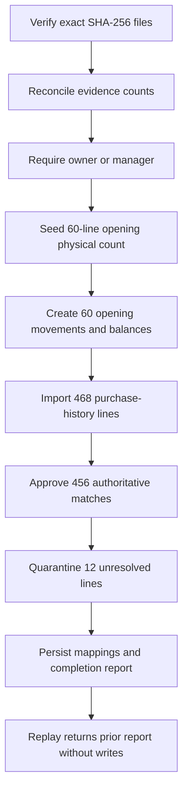

# Phase 5 architecture and interaction flows

## Module ownership

| Module | Owns | Consumed contract |
|---|---|---|
| Inventory | home products, locations, counts, movements, balances | `InventoryMovementGateway`, `InventorySummaryReader` |
| Purchasing | stores, receipts, reviewed lines, matches, price observations | calls `InventoryMovementGateway` only |
| Shopping | lists, list lines, Phase 5 parity policy | `ShoppingSummaryReader` |
| Reporting | dashboard composition | reader interfaces, never another module's DBAL class |
| Administration | verified one-time baseline migration | application ports and a dedicated migration adapter |

Application services depend on ports. Doctrine DBAL stays in infrastructure.
HTTP handlers translate transport input and authenticated identity into
application calls. Home authorization occurs before every read or write.

## Approved receipt flow

The transaction encompasses the movement and receipt-state changes. A repeated
commit of an already committed receipt returns zero new movements. Movement
identity is unique by home, source type, source ID, and home product.

## Physical count flow

Count lines store observations; they do not mutate stock while the session is
open. Closing converts each difference into an immutable movement. This keeps
the audit trail explainable and makes balance rebuilding deterministic.

## Balance invariant

For a home product \(p\), the materialized balance must equal:

\[
  balance(p) = \sum_{m \in movements(p)} m.quantity\_delta
\]

`inventory_balances` is a read optimization. `stock_movements` is the source of
truth. Owner or manager users can execute the rebuild endpoint, which deletes
only that home's materialized balances and recomputes them from its ledger in
one transaction.

## Baseline cutover

No receipt media is invented or persisted. Legacy history is explicitly
labelled as purchase evidence, not a scanned receipt. The importer runs inside
one transaction; a failed post-import reconciliation rolls everything back.

## Concurrency and isolation

- All resource reads and writes include `home_id`.
- Mutable aggregate writes use expected revisions.
- Multi-row writes execute through the shared transaction manager.
- Receipt and count commits are immutable after success.
- Duplicate client operations replay their existing movement.
- Catalog and home-product references are validated in the same home scope.
- RFC 9457 problem responses expose safe client errors, not database details.
