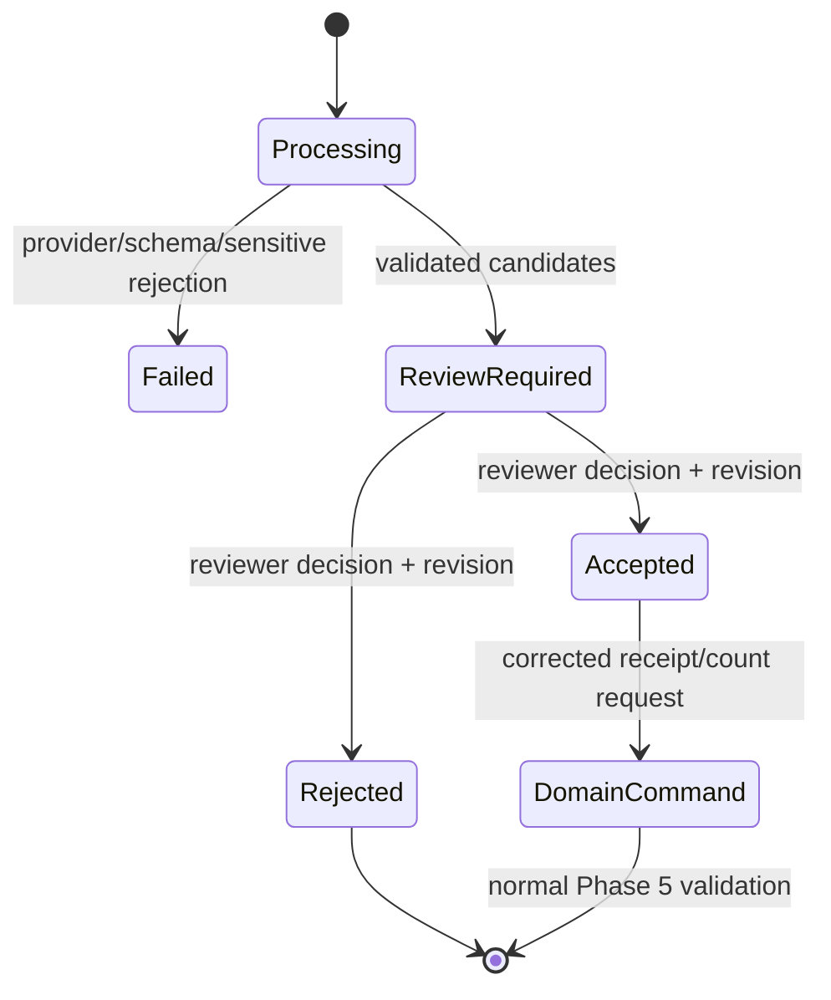

# Phase 6 architecture and interaction flows

## Responsibility boundaries

| Boundary | Responsibility |
|---|---|
| Client | crop/rotate, remove metadata, preview, name the provider/privacy mode, obtain explicit consent |
| AI application service | home RBAC, mode policy, media verification, provider selection, schema revalidation, review state |
| Provider adapter | translate the versioned request and normalize only structured output and token counts |
| Credential cipher | authenticated encryption using deployment key plus home/provider associated data |
| Phase 5 domains | apply corrected receipt/count commands and create movements only after their own approval rules |

Provider URLs are deployment configuration, never request parameters. The HTTP
adapter denies credentials in URLs, query strings, fragments, redirects,
unlisted hosts, non-HTTPS public endpoints, and private addresses unless a
deployment explicitly enables the private-network mode.

## Server-proxy extraction

```mermaid
sequenceDiagram
    participant Client
    participant API as AI application
    participant Vault as Encrypted credential row
    participant Provider
    participant Review as Human reviewer
    participant Domain as Receipt or count domain

    Client->>Client: Crop, strip metadata, preview
    Client->>API: Image + target + explicit consent
    API->>API: RBAC, magic bytes, size, EXIF, mode
    API->>Vault: Decrypt home/provider credential in memory
    API->>Provider: Bounded structured request
    Provider-->>API: Structured proposal
    API->>API: Revalidate exact schema
    API->>API: Persist digest, metadata, candidates
    API-->>Client: Review-required result
    Review->>API: Accept or reject candidate revision
    API-->>Review: Decision recorded; stock unchanged
    Review->>Domain: Submit corrected normal command
    Domain-->>Review: Receipt/count revision updated
```

The image exists only in request memory and the outbound provider request.
OpenAI requests set `store: false`; this is an additional provider instruction,
not a claim that the image stayed on-device. The API stores a SHA-256 digest
and byte count so duplicate/incident analysis is possible without retaining
the media.

## Privacy-mode truth

| Mode | Credential and image path | Server extraction endpoint |
|---|---|---|
| `manual_only` | no provider and no image transmission | rejected |
| `server_proxy` | device → Providentia memory → configured provider; encrypted server credential | enabled when deployment and home both opt in |
| `local_direct` | device → user-controlled local/LAN Ollama-compatible client integration | rejected because the client owns this path |

Advanced native direct cloud BYOK is intentionally disabled in this
checkpoint. A later native-client decision must include operating-system vault
storage and an explicit key-exposure warning. Browser storage is not an
acceptable credential vault.

## Human-review state



Review decisions use `(extraction_id, position, revision)` optimistic
concurrency. Repeating a stale decision returns a conflict. Changing a review
decision is possible only with the current revision, preserving who made the
latest explicit choice and when.

## Stored and excluded data

Stored:

- home, kind, optional target, provider, model, status;
- MIME type, SHA-256 digest, byte count;
- schema and prompt-template versions;
- validated structured output, candidates, confidence, warnings;
- duration and whitelisted token counts when supplied;
- reviewer identity, decision, revision, and timestamps.

Excluded:

- original or derived image bytes;
- EXIF and local file paths;
- plaintext or displayable credentials;
- raw provider response bodies and unsafe error details;
- hidden chain-of-thought;
- automatic catalog, receipt, count, price, or movement writes.
