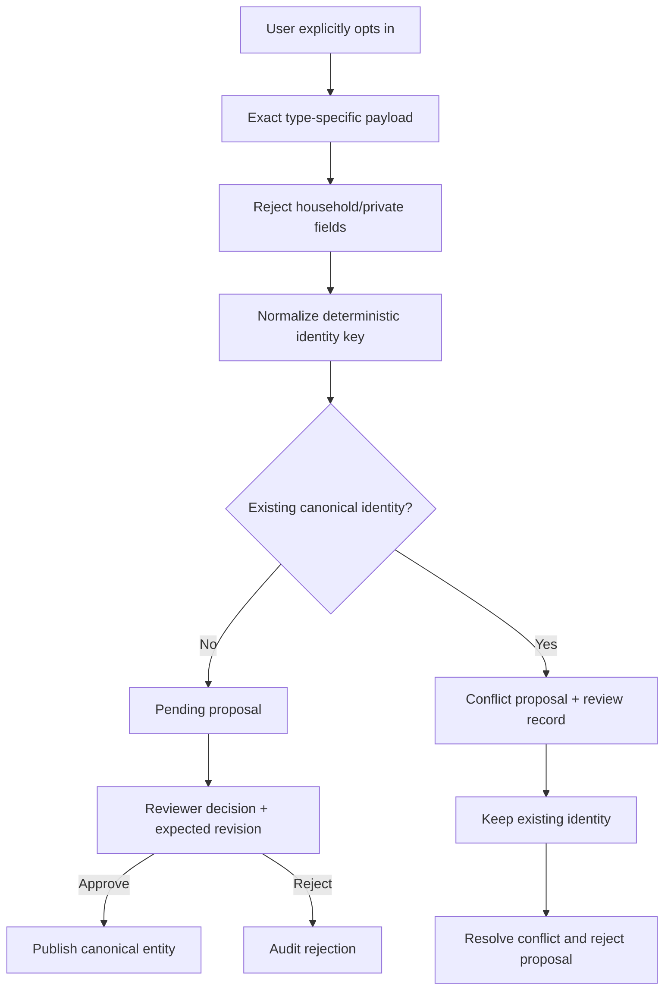
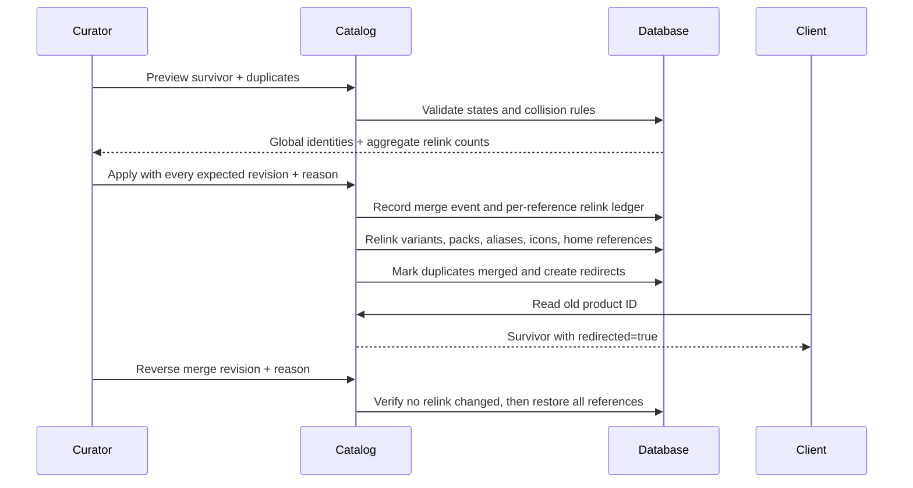

# Phase 7 governance architecture and flows

## Authority matrix

| Capability | Authenticated user | Reviewer | Curator | Platform administrator |
|---|---:|---:|---:|---:|
| Submit sanitized proposal | Yes | Yes | Yes | Yes |
| Read moderation workbench | No | Yes | Yes | Yes |
| Approve/reject clean proposal | No | Yes | Yes | Yes |
| Keep existing identity on conflict | No | Yes | Yes | Yes |
| Register icon metadata | No | No | Yes | Yes |
| Preview/apply/reverse merge | No | No | Yes | Yes |
| Read household data | Home role only | No implied access | No implied access | No implied access |

Platform roles are read from the authenticated server session. A client-sent
role or a home owner/manager role never grants catalog authority.

## Proposal flow

The proposal payload contains only fields needed for a reusable catalog
identity. No home reference is stored in the proposal or conflict record.
Conflicted proposals cannot be approved directly; this prevents alias takeover
and barcode reassignment through an ordinary review click.

## Merge flow

Merge execution is one database transaction. Variant-label, normalized pack,
or approved-alias collisions across any selected pair block the merge rather
than inventing a winner. A product with active incoming redirects cannot be
merged again, so redirects remain one hop and reversals stay unambiguous.
Reversal also fails closed when a relink has changed since the merge, requiring
explicit manual repair rather than overwriting newer curator work.

## Durable redirect rule

The duplicate product row is retained with `status=merged`. A separate redirect
maps its permanent ID to the survivor. Existing home records and clients can
continue using an old ID; the canonical product read resolves the redirect and
states both `requestedId` and `redirected`.

On reversal the redirect becomes inactive and every relink ledger entry moves
back to its original duplicate. No purchase, movement, count, or price history
is deleted.

## Icon boundary

The API accepts only metadata for a content-addressed public asset: SHA-256,
media type, dimensions, byte size, alt text, provenance, and revision. It does
not accept raw SVG or bitmap bytes. The deployment's asset pipeline must scan,
sanitize, and store the object before a curator registers its digest.
