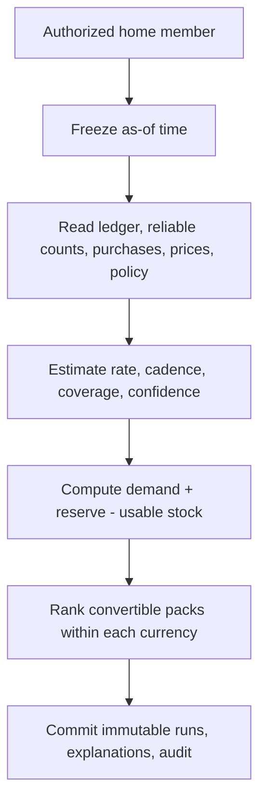
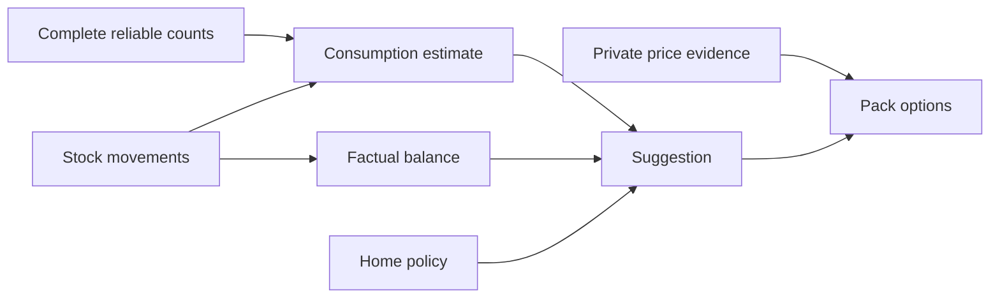
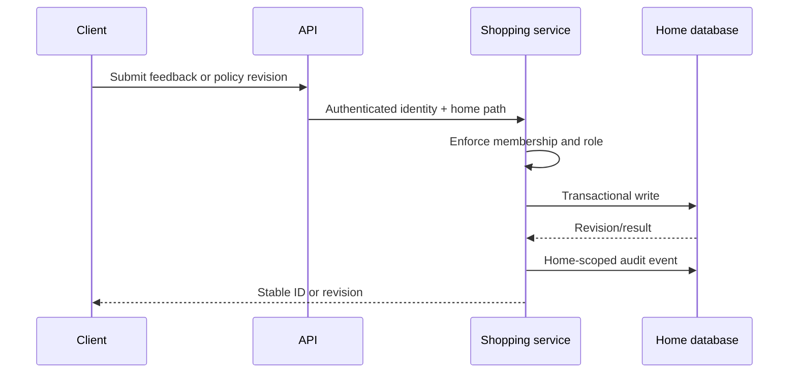
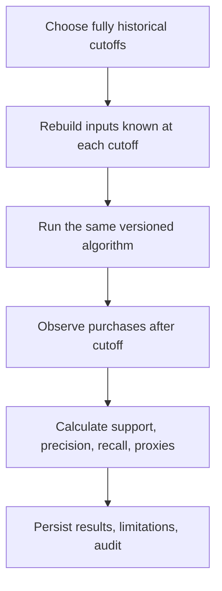

# Phase 8 architecture and interaction flows

## Module boundaries

The Shopping application owns orchestration and depends on ports. Its domain
classes contain deterministic arithmetic and no framework or persistence
dependencies. Doctrine DBAL implements home-scoped evidence reads and immutable
run writes. Reporting reads narrow analytics ports from Inventory, Purchasing,
and Shopping; it does not reach into their tables itself.

| Boundary | Responsibility |
|---|---|
| `Shopping/Domain` | Fixed decimal arithmetic, consumption, replenishment, pack ranking |
| `Shopping/Application` | Home authorization, immutable runs, feedback, policies, evaluation |
| `Shopping/Infrastructure` | Knowledge-time SQL, run persistence, audit records |
| `Inventory/Application` | Factual inventory report port |
| `Purchasing/Application` | Committed purchase fact port |
| `Reporting/Application` | Authorized composition and report audit |
| `Http` | Authentication handoff, request parsing, response shape only |

## Suggestion generation

The application obtains one clock value and uses it for every input and output
in the run. The input watermark records the newest eligible fact timestamps.
The estimate and suggestion run IDs connect every response to the exact method
and inputs that produced it.

## Evidence and fact separation

Movement quantity is factual. Count intervals, cadence, confidence, expected
demand, and required quantity are derived. The API and reports keep those
terms distinct so a client cannot accidentally label a forecast as current
stock.

## Feedback and policy flow

Members may accept, edit, dismiss, or snooze a generated suggestion. Owner and
manager roles may change the longer-lived replenishment policy with optimistic
revision checks. Feedback preserves original and resulting quantities; it does
not silently rewrite the immutable suggestion.

## Historical evaluation

An event with an old business date but a `created_at` after the cutoff is not a
model input. The same rule applies to price observations. Preference revisions
are selected as of the cutoff. Outcome purchases are read only from the later
evaluation window.

## Household reporting

All four report routes require home membership. Inventory and Purchasing expose
small analytics reader ports, while Shopping exposes immutable intelligence
reads. Reporting composes those results and writes a metadata-only audit event;
it never receives platform-role authority as a substitute for home membership.
